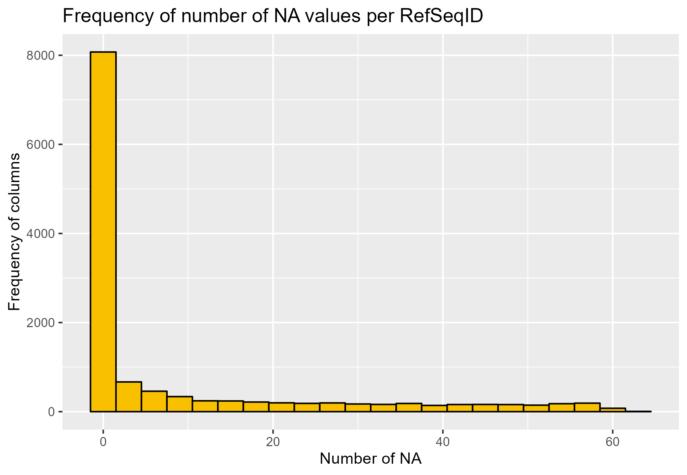
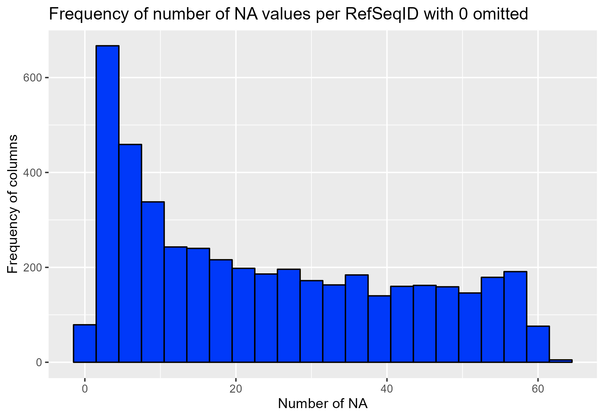
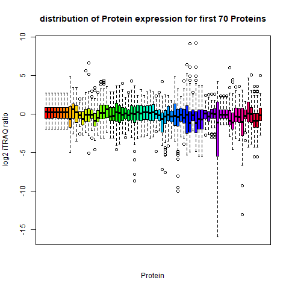

```{r setup, include=FALSE}
knitr::opts_chunk$set(echo = TRUE)
knitr::opts_chunk$set(warning = FALSE)
knitr::opts_chunk$set(fig.align = "center")
library(RWeka)
library(pander)
library(here)

knitr::opts_knit$set(root.dir = here::here())
```


```{r data_loading, include=FALSE}
data_set <- read.arff("Analysis//data//cleaned_merged_data.arff")

```


\newpage
<!-- (Introduction) -->
# Introduction
In today's world although breast cancer has reach a high rate of awareness and research its still a significant problem  [2].
 With 1 in 8 women getting a form of brest cancer.
so it is still important to get a quick diagnosis of the stage of the cancer. the stages used in this report ar T1 to T4.
T1 in this stage the cancer has not grown deeply in surrounding tissue yet, and hasn't reached a lymph node or other parts of the body. T2 and T3 in these two stages the cancer has grown more deeply in the surrounding tissue and may have reached a lymph node in the body but not other parts of the body. T4 means that in this stage the cancer has reached and gropwn into other organs or parts of the body. There are more type of cancer classification but these arent applicable or used in this report and analayses for simplicity. for classification of these stages we are looking at protein expression data.
the data we used assess how the mutations in the DNA are affecting the protein expression landscape in breast cancer. Genes in our DNA are first transcribed into RNA molecules which then are translated into proteins. Changing the information content of DNA has impact on the behavior of the proteome, which is the main functional unit of cells, taking care of cell division, DNA repair, enzymatic reactions and signaling etc. normally This data containing is filtered for proteins originating from a list of 50 genes called PAM50. and these are selected to further classify the type/subtypes of brest cancer on.
 PAM50 is a list of 50 genes that classify breast cancers into one of five intrinsic subtypes from formalin-fixed, paraffin-embedded tissues by real time polymerase chain reaction (RT-PCR) (62). These 50 genes identified were refined from a list of 1,906 genes, which were found in four previous microarray studies.
my question is: Are there different ways to categorize breast cancer based on protein expression data, with machine learning being used to classify them without using the pam50 proteins?

\newpage
<!-- (Methods) -->
# Material & Methods

#### Data
The data set contains published iTRAQ proteome profiling of 77 breast cancer samples generated by the Clinical Proteomic Tumor Analysis Consortium (NCI/NIH). It contains expression values for ~12.000 proteins for each sample, with missing values present when a given protein could not be quantified in a given sample.
This data was sampled from 105 originally from the TCGA (The Cancer Genome Atlas Program - NCI), which was further filterd to 77 samples containing high quality protein expression data.
Normally a filter is applied over protein expression dat like this to make more sense out of it like the PAM50. Since my research question is about finding new proteins and or ways to classify them without this PAM50 , it won't be used.

First the columns with Gene_symbols and gene_name where stripped from it so the data set now only contained numerical data.
After that step the data from the clinical data is merged with the samples from the protein expressions, but to first do this the names of the samples must correspond with the names/ID used in the clinical data set. For  example in the protein dat we have : ```A0.A12D.01TCGA``` and in the clinical dat we had ```TCGA-A0-A12D```. For this a regex and split method was used to search on ```"TCGA"``` and split the names/ID's on ```_ and - and .``` and at last it was rearranged to the clinical data format for its name/ID.
Thirdly the dataset containing the log2 protein expression data is transposed and its RefSeq accession number is used as the column names, so that each row is a new instance(samples) and the column are te attributes(proteins).
After those first cleaning and formatting steps proteins with more than 10% of there values missing where removed from the data set.

this yielded the final data set that was used for the machine learning.
this was exported to a .arff file created with the Rweka library in the logbook ```Thema_09_log_Mats_Slik.rmd``` found in the repository of this research.

#### machine learning

For the machine learning```Weka 3.8.6``` was used. The data set was first loaded in the


#### java wrapper
[here](https://github.com/MaDLuck5/Thema_09_Machine_Learning).

\

\newpage
<!-- (Results) -->
# Results

When looking at the dimensions of the data set we can see there are a lot of proteins
see table 1
```{r data_dimensions, echo = FALSE, fig.cap = "Table 1"}
pander(head(data_set[1:6]), n = 5)
cat("number of rows:", nrow(data_set),
    "number of columns:", ncol(data_set), '\n')
```
With this distribution we can clearly see that there are a lot of attributes per instance, normally u want around ten percent of N instances as attributes. in this data set that corresponds with around 7 attributes. This limit our options on the machine learning part. /newline

After this first assessment of the data we started looking at the number of missing values as seen in the figures' fig 1 and 2 below, this is done to ascertain if there are a lot of missing values in the data set en if we neet to filter them out for better result later on in with the machine learning part

{width=50%}


{width=50%}


As we can see in these figures 1 and 2 the distribution is very much to the left where a lot of proteins have one or only two missing values,
further more there are still a couple of proteins that have a high number of missing values these are to be filtered out because this can create a false set of results when we are using them in our machine learning algorithm for classifying them on their cancer stage.
so to further visualize the data  we took the distribution of a couple of proteins in a multi boxplot as seen in figure 3. \newline


{width=70%}


In this figure 3 we can clearly see that for the first 70 protein that most have a distribution of their log2 itraq expression between 5 and -5 but there are some that have higher numbers. To further make sense of all the 12 to 9 thousand proteins in the data we calculated the standard deviation of them see figure 4

{width=70%}


In this figure 4 we compared the normal data set and the one filtered that has had protein with more tha 10% of their values missing removed.
In it, we can clearly see that a lot of proteins with high deviation are removed from the data. To make a further analyse of these samples

```{r plot figure, echo = FALSE, fig.cap = "distribution of amount of samples per tumor stage" ,  out.width = "70%"}
plot(data_set$Tumor, ylab = "Count", xlab="tumor stage", col ="#F9C000", main = "distribution of tumor stage")
```
In this figure 5 we can see how the different samples are spread according to there cancer stages.
here we can see a clear bias towards T2.

\newpage

##### machine learning  \newline

\begin{table}[thb]
\caption{\label{Weka Experimenter algorithms}Tabel with the algorithms with default settings used in initial comparison .}
\footnotesize
\begin{tabular}{l}
 (1) rules.OneR '-B 6' -3459427003147861500 \\
 (2) trees.RandomTree '-K 0 -M 1.0 -V 0.001 -S 38' -9051119597407395800 \\
 (3) trees.RandomForest '-P 100 -I 100 -num-slots 1 -K 0 -M 1.0 -V 0.001 -S 38' 1116839470751428740 \\
 (4) trees.J48 '-C 0.25 -M 2' -217733168393644448 \\
 (5) meta.AttributeSelectedClassifier '-E \"CfsSubsetEval -P 6 -E 6\"  -S \"GreedyStepwise -T -1.7976931348623157E308 -N -1 -num-slots 1\" -W trees.J48 -- -C 0.25 -M 2' -1151805453487947520 \\
 (6) meta.AttributeSelectedClassifier '-E \"CfsSubsetEval -P 6 -E 6\"  -S \"BestFirst -D 2 -N 5\" -W trees.J48 -- -C 0.25 -M 2' -1151805453487947520 \\
 (7) meta.AttributeSelectedClassifier '-E \"CfsSubsetEval -P 6 -E 6\"  -S \"BestFirst -D 2 -N 5\" -W trees.RandomForest -- -P 100 -I 100 -num-slots 1 -K 0 -M 1.0 -V 0.001 -S 1' -1151805453487947520 \\
 (8) meta.AttributeSelectedClassifier '-E \"CfsSubsetEval -P 6 -E 6\"  -S  \"BestFirst -D 2 -N 5\" -W trees.RandomTree -- -K 0 -M 1.0 -V 0.001 -S 38' -1151805453487947520
\end{tabular}
\end{table}

the results are as seen in table 3

\begin{table}[thb]
\caption{\label{Weka Experimenter Results}Tabel with a T test performed on the percentage each algorithm correctly predicted.}
\footnotesize
\begin{tabular}{l|llllllll}
 Dataset & (1) rules.On  & (2) trees & (3) trees & (4) trees & (5) meta. & (6) meta. & (7) meta. & (8) meta.  \\ \hline
 percentage correctly classified & 59.74 & 50.65 & 66.23 & 35.06 * & 45.45 & 42.86 * & 62.34 & 46.75 \\
 Significance   & (v = better/ Same /* = Worse)  & (0/1/0) & (0/1/0) & (0/0/1) & (0/1/0) & (0/0/1) & (0/1/0) & (0/1/0)
\end{tabular}
\end{table}

as  can bee seen from these results in table 3 nothing really stands out from the rest, they all perform quit bad especially if u compare it with the OneR and ZeroR.
For further, because of these result and the dimensions of the data set as seen in tabel 1 and figure 5, further machine learning will be focused on the AttributeSelectedClassifier

So for further testing we firstly make a good baseline with the zeroR and further make comparisons with mutiple combinations of the meta.AttributeSelectedClassifier and its parameters. \newline

The next set of test where done in the weka explorer gui. \newline

The first of these is a ZeroR and the rest are the results of a few of the best AttributeSelectedClassifier, since most of them are extremely poor performing and not worthy of mentioning the results at all.
After showing these results we shall make a conclusion about which algorithm performs the best.
All of the following test runs have been made with crossvallidation with the leave one out method to maximise the limited number of instances in the data. \newline
##### ZeroR  \newline
\begin{table}[tbh]
\caption{\label{Results ZeroR}Tabel with the summary of results from zeroR}
\footnotesize
\begin{tabular}{l|ll}
 Correctly Classified Instances & 51 & 66.2338 \\ \hline
 Incorrectly Classified Instances & 26 & 33.7662 \\ \hline
 Kappa statistic  & 0 & x \\ \hline
 Mean absolute error & 0.2665 & x \\ \hline
 Root mean squared error & 0.3613 & x \\ \hline
 Relative absolute error & 100 & x \\ \hline
 Root relative squared error & 100 & x \\ \hline
 Total Number of Instances & 77 & x
\end{tabular}
\end{table}

\begin{table}[tbh]
\caption{\label{ZeroR Confusion matrix}Confusion matrix}
\begin{tabular}{llll|l}
 a & b & c & d & <-- classified as \\ \hline
 0 & 10 & 0 & 0 & a = T1 \\ \hline
 0 & 51 & 0 & 0 & b = T2 \\ \hline
 0 & 11 & 0 & 0 & c = T3 \\ \hline
 0 & 5 & 0 & 0 & d = T4
\end{tabular}
\end{table}

As we can see from the results of ZeroR in *tabel 5* that even classifying everything as T2 scores 66% good, thus using that as a base of evaluationg the classifiers used is not very reliable and we shall take the confusing matrix as the first metric to see if a particular model has any merit to for further analyses and testing/ \newline

##### AttributeSelectedClassifier with cost sensitive J48 \newline

This is the second algorithm used, and this is using attribute selection with sub set evaluation based on the best first method.
as a cost matrix in I assigned every wrongly classified instance as class T2 extra heavy since that class is overrepresented, furthermore it is added that every clas that is wrongly classified is weight little heavier than a T2 class that is wronly classified.

Relation:     R_data_frame \newline
Instances:    77 \newline
Attributes:   9200 \newline
Test mode:    77-fold cross-validation \newline
Evaluation cost matrix: \newline

\begin{table}[tbh]
\begin{tabular}{llll}
 0 & 5 & 2 & 2 \\
 1 & 0 & 1 & 1 \\
 1 & 5 & 0 & 2 \\
 2 & 5 & 2 & 0 \\

\end{tabular}
\end{table}

=== Attribute Selection on all input data === \newline

Search Method: \newline
    Best first. \newline
    Start set: no attributes \newline
    Search direction: forward \newline
    Stale search after 5 node expansions \newline
    Total number of subsets evaluated: 211334 \newline
    Merit of the best subset found:    0.601 \newline

Attribute Subset Evaluator (supervised, Class (nominal): 9200 data.class): \newline
    CFS Subset Evaluator \newline
    Including locally predictive attributes \newline

Selected attributes: 338,905,1188,1230,1555,2172,2277,2821,3196,3333,3719,3932,5844,6802,7234,7490,7959,8149,8538 : 19 \newline


\begin{table}[tbh]
\caption{\label{Results cost sensitive Results with attribute selector}Tabel with the summary of results from zeroR}
\footnotesize
\begin{tabular}{l|ll}
 Correctly Classified Instances & 22 & 28.5 \\ \hline
 Incorrectly Classified Instances & 55 & 71.4 \\ \hline
 Kappa statistic  & -0.1735 & x \\ \hline
 Total Cost &  135 \\ \hline
 Average Cost & 1.7532 \\ \hline
 Mean absolute error &  0.3473 & x \\ \hline
 Root mean squared error & 0.5733 & x \\ \hline
 Relative absolute error & 129.1465 & x \\ \hline
 Root relative squared error & 156.9896 & x \\ \hline
 Total Number of Instances & 77 & x
\end{tabular}
\end{table}

\begin{table}[tbh]
\caption{\label{cost sensitive J48 Confusion matrix}Confusion matrix}
\begin{tabular}{llll|l}
 a & b & c & d & <-- classified as \\ \hline
 1 & 7 & 2 & 0 & a = T1 \\ \hline
 8 & 19 & 19 & 5 & b = T2 \\ \hline
 2 & 8 & 1 & 0 & c = T3 \\ \hline
 0 & 4 & 0 & 1 & d = T4
\end{tabular}
\end{table}
\newpage

in the above seen confusion matrix *table 7* we are looking for a nicely made line from the top left to the bottom right, but we can clearly see that that is not the case. So this algorithm doesn't have a lot of merit for further exploration

##### AttributeSelectedClassifier HoeffdingTree  \newline

In this third algorithm a HoeffdingTree was used as the base algorithm, although this algorithm is normally used for web based streaming inputs and thus not really applicable to this data. it was one of the better ones according to its accuracy but worse on other aspect as well see further on in its results.

Relation:     R_data_frame \newline
Instances:    77 \newline
Attributes:   9200 \newline
Test mode:    77-fold cross-validation \newline
Evaluation cost matrix: \newline

\begin{table}[tbh]
\begin{tabular}{llll}
 0 & 5 & 2 & 2 \\
 1 & 0 & 1 & 1 \\
 1 & 5 & 0 & 2 \\
 2 & 5 & 2 & 0 \\

\end{tabular}
\end{table}

=== Attribute Selection on all input data === \newline

Search Method: \newline
    Best first. \newline
    Start set: no attributes \newline
    Search direction: bi-directional \newline
    Stale search after 5 node expansions \newline
    Total number of subsets evaluated: 248373 \newline
    Merit of best subset found:    0.604 \newline

Attribute Subset Evaluator (supervised, Class (nominal): 9200 data.class): \newline
    CFS Subset Evaluator \newline
    Including locally predictive attributes \newline

Selected attributes: 338,1188,1230,1555,2172,2277,2844,3196,3333,3719,3932,5844,6802,7234,7490,7959,8149,8538 : 18 \newline

\begin{table}[tbh]
\caption{\label{Results attribute selector with HoeffdingTree}Tabel with the summary of results from HoeffdingTree}
\footnotesize
\begin{tabular}{l|ll}
 Correctly Classified Instances & 45 & 58.4 \\ \hline
 Incorrectly Classified Instances & 32 & 41.5 \\ \hline
 Kappa statistic  & -0.0584 & x \\ \hline
 Mean absolute error &  0.2337 & x \\ \hline
 Root mean squared error & 0.4332 & x \\ \hline
 Relative absolute error & 86.9241 & x \\ \hline
 Root relative squared error & 118.6126 & x \\ \hline
 Total Number of Instances & 77 & x
\end{tabular}
\end{table}


\begin{table}[tbh]
\caption{label{HoeffdingTree confusionmatrix}Confusion matrix}
\begin{tabular}{llll|l}
 a & b & c & d & <-- classified as \\ \hline
 0 & 9 & 1 & 0 & a = T1 \\ \hline
 5 & 45 & 1 & 0 & b = T2 \\ \hline
 1 & 10 & 0 & 0 & c = T3 \\ \hline
 0 & 5 & 0 & 0 & d = T4
\end{tabular}
\end{table}
\newpage

in the above seen confusion matrix *table 9* we are still looking for a nicely made line from the top left to the bottom right, but we can clearly see that that is not the case, and it classifies them mostly as t1 and t2.

##### AttributeSelectedClassifier Ranker RandomTree  \newline

Relation:     R_data_frame \newline
Instances:    77 \newline
Attributes:   9200 \newline
Test mode:    77-fold cross-validation \newline
Evaluation cost matrix: \newline

\begin{table}[tbh]
\begin{tabular}{llll}
 0 & 5 & 2 & 2 \\
 1 & 0 & 1 & 1 \\
 1 & 5 & 0 & 2 \\
 2 & 5 & 2 & 0 \\

\end{tabular}
\end{table}


Selected attributes: 4526,6015,1443,1312,8523,2172,1230,5384,2277,4206,8329,1188 : 12 \newline

\begin{table}[tbh]
\caption{\label{Results of attribute selector with ranker }Tabel with the summary of results from Randomtree }
\footnotesize
\begin{tabular}{l|ll}
 Correctly Classified Instances & 42 & 54.5 \\ \hline
 Incorrectly Classified Instances & 35 & 45.5 \\ \hline
 Kappa statistic  & 0.1126 & x \\ \hline
 Mean absolute error &  0.226 & x \\ \hline
 Root mean squared error & 0.4726 & x \\ \hline
 Relative absolute error & 84.0 & x \\ \hline
 Root relative squared error & 129.4 & x \\ \hline
 Total Number of Instances & 77 & x
\end{tabular}
\end{table}


#### confusion matrix

\begin{table}[tbh]
\caption{label{RandomTree confusionmatrix}Confusion matrix}
\begin{tabular}{llll|l}
 a & b & c & d & <-- classified as \\ \hline
 3 & 4 & 3 & 0 & a = T1 \\ \hline
 3 & 38 & 7 & 3 & b = T2 \\ \hline
 5 & 6 & 0 & 0 & c = T3 \\ \hline
 0 & 4 & 0 & 1 & d = T4
\end{tabular}
\end{table}
\newpage


in the above seen confusion matrix we are looking for a nicely made line from the top left to the bottom right, but we can clearly see that that is not the case, and it classifies them mostly wrong as t2. So this algorithm doesn't have a lot of merit for further exploration \newline

##### AttributeSelectedClassifier greedystepwise with OneR  \newline

Relation:     R_data_frame \newline
Instances:    77 \newline
Attributes:   9200 \newline
Test mode:    77-fold cross-validation \newline
Evaluation cost matrix: \newline


=== Attribute Selection on all input data === \newline

Search Method: \newline
    Greedy Stepwise (forwards). \newline
    Start set: no attributes \newline
    Merit of best subset found:    0.601 \newline

Attribute Subset Evaluator (supervised, Class (nominal): 9200 data.class): \newline
    CFS Subset Evaluator \newline
    Including locally predictive attributes \newline

Selected attributes: 338,905,1188,1230,1555,2172,2277,2821,3196,3333,3719,3932,5844,6802,7234,7490,7959,8149,8539 : 19 \newline

\begin{table}[tbh]
\caption{\label{OneR results}Tabel with the summary of results from OneR}
\footnotesize
\begin{tabular}{l|ll}
 Correctly Classified Instances & 45 & 58.44 \\ \hline
 Incorrectly Classified Instances & 32 & 41.55 \\ \hline
 Kappa statistic  & -0.0788 & x \\ \hline
 Total Cost &  133   \\ \hline
 Average Cost &  1.7273 \\ \hline
 Mean absolute error &  0.2078 & x \\ \hline
 Root mean squared error & 0.4558 & x \\ \hline
 Relative absolute error & 77.2714 & x \\ \hline
 Root relative squared error & 124.8216 & x \\ \hline
 Total Number of Instances & 77 & x
\end{tabular}
\end{table}

\begin{table}[tbh]
\caption{label{greedystepwise with OneR confusionmatrix}Confusion matrix}
\begin{tabular}{llll|l}
 a & b & c & d & <-- classified as \\ \hline
 0 & 9 & 1 & 0 & a = T1 \\ \hline
 2 & 45 & 4 & 0 & b = T2 \\ \hline
 0 & 11 & 0 & 0 & c = T3 \\ \hline
 0 & 5 & 0 & 0 & d = T4
\end{tabular}
\end{table}
\newpage

in the above seen confusion matrix we are looking for a nicely made line from the top left to the bottom right, but we can clearly see that that is not the case, we can see that is mostly classify them as T2. So this algorithm doesn't have a lot of merit for further exploration \newline

#### Machine learning summary /newline

these are but the best of the multiple different settings that where tried, but all results where the same as these presented in the chapters here above. one if not the first things that stands out for every one of these results is that none of these results scored an accuracy of correctly predicting the class of the data better than ZeroR with its 66.2%. One got close but that was a RandomTree model without attributeselection, so it is questionable how accurate its truly is. But accuracy of correctly prediction the class is not everything, so we must also look at the confusion matrix's that where produced.
As can be seen from the confusion matrix's (tables ) there are two trends visible that firstly there is a huge bias towards t2
Thus, most of the models that where teste where with the meta learning AttributeSelectedClassifier , and yielded not much as explained above.
The main thing that can be said of all the methods and algorithems used is they performed all bad or equally bad as just picking a random class.
One more thing is that a significant portion the models that where tried with the AttributeSelectedClassifier is that they almost all chose these  attributes : \newline NP_008832
,NP_056289,NP_001349,NP_055719,NP_001150,NP_079093,NP_000959,NP_004893,NP_004887,NP_065901,NP_058632,NP_002630,NP_060947,NP_065109,NP_848613,NP_001035147,NP_005639,NP_001092102,NP_001017 \newline

\newpage
<!-- (Discussion and Conclusion) -->
# Discussion and Conclusion  \newline

In the results' section we can see from the figures 1 and two that although the data set was supplied with the label as high quality there are still proteins in the data with
more tha 10% of there expression values missing, this combined with the need for using the expressing data with the clinical categorical data, the sample names needed to be changed to be compare.
all this wasn't something expected of high quality data. also in figure 5 it is clearly visible that T2 stage is oversampled and creates a bias in every alogoritme used, in the samples than any other.
furthermore the sheer amount of proteins recorded in this data is very useful for my purpose of trying to use another classification as the PAM50 protein list
<!-- (After-Body) -->
```{r after body, child = 'report/report-dependencies/after_body.Rmd'}
```
