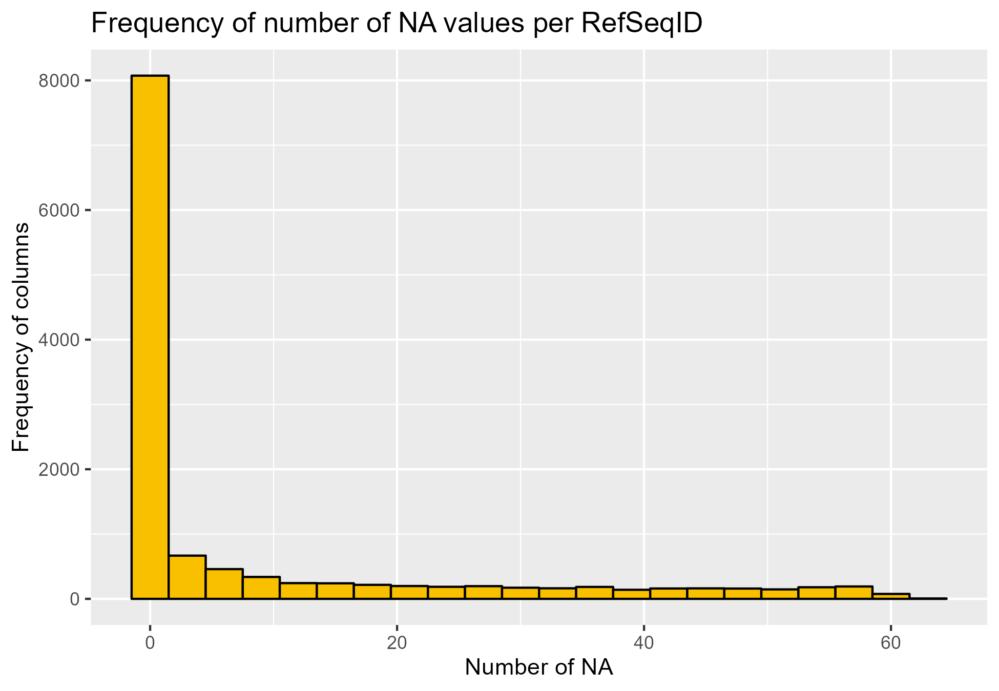
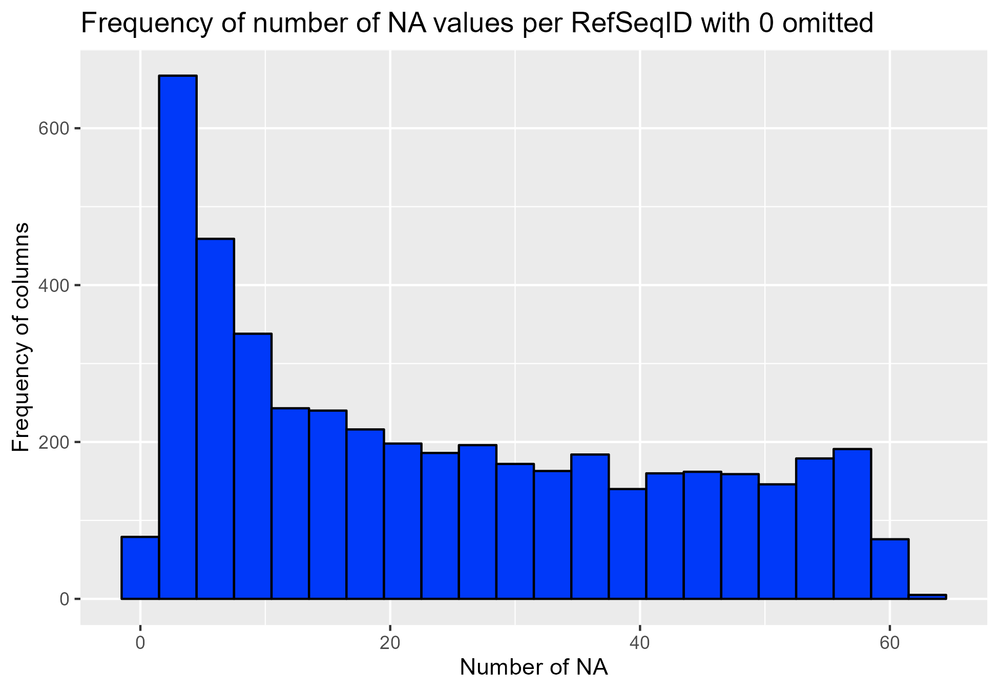
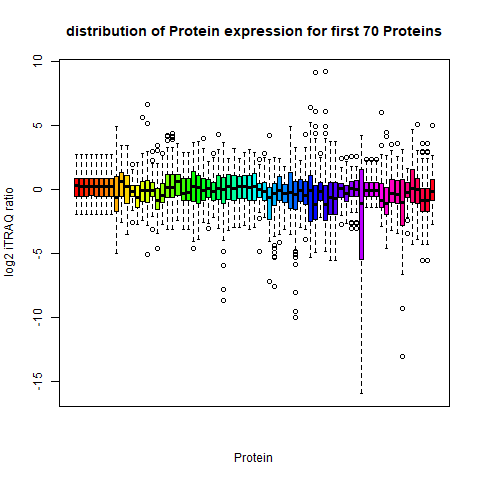
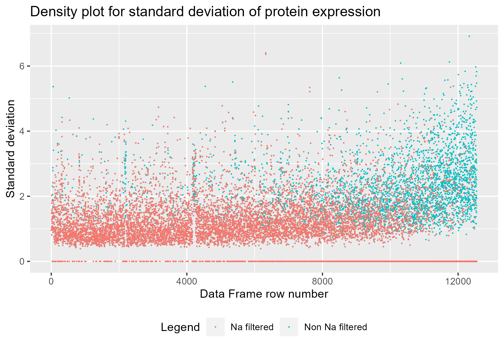

```{r setup, include=FALSE}
knitr::opts_chunk$set(echo = TRUE)
knitr::opts_chunk$set(warning = FALSE)
knitr::opts_chunk$set(fig.align = "center")
library(RWeka)
```
```{r data_loading, include=FALSE}
data_set <- read.arff("..//data//cleaned_merge_data.arff")

```


\newpage
<!-- (Introduction) -->
# Introduction
??


\newpage
<!-- (Methods) -->
# Methods


\newpage
<!-- (Results) -->
# Results
When looking at the dimensions of the data set we can see there are allot of proteins
```{r data_dimensions , include = FALSE, echo = TRUE}
cat("number of rows:", nrow(data_set),
    "number of columns:", ncol(data_set), '\n')
```





\newpage
<!-- (Discussion and Conclusion) -->
# Discussion and Conclusion

<!-- (After-Body) -->
```{r after body, child = 'report-dependencies/after_body.Rmd'}
```
